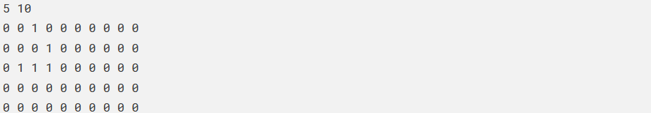
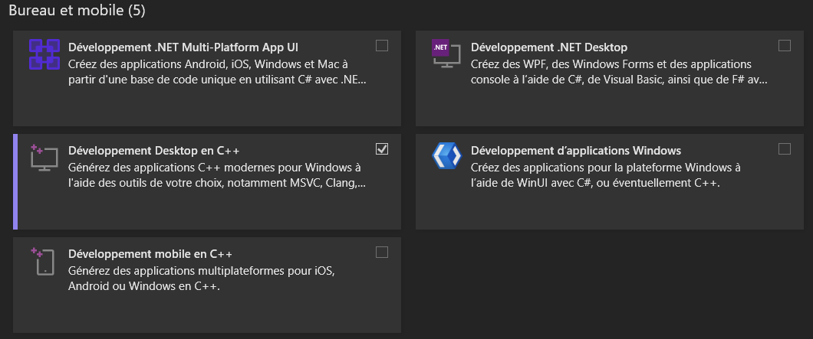

# Projet-POO-Jeu-de-la-vie
Projet de groupe scolaire fait à l'école CESI qui a pour but de créer le jeu de la vie.
On a utiliser des notions de POO pour achever ce projet

# Technologie utiliser :
**Visual Studio Community 2022, C++, bibliothèque SFML.**

# Enoncer du projet
## Principe
Le jeu de la vie désigne un automate cellulaire proposé par le mathématicien John Conway. 
Il décrit l’évolution d’une population de cellules sur un intervalle de temps discret. 
Les cellules placées dans une grille rectangulaire deux dimensionnelle sont caractérisées par deux états ; elles sont soit vivantes, soit mortes. 
A l’exclusion des bordures, le voisinage d’une cellule est formé par 8 autres cellules directement adjacentes. 
Pour passer de l’itération tt à l’itération t+1t+1, l’état des cellules dans la grille est actualisé selon les règles suivantes :

- Une cellule morte possédant exactement trois voisines vivantes devient vivante.
- Une cellule vivante possédant deux ou trois voisines vivantes reste vivante, sinon elle meurt.

Vous proposerez une implémentation en C++ du jeu de la vie en vous reposant sur les concepts de la programmation orientée objet. 
En entrée, votre programme consommera un fichier dont la première ligne permettra de spécifier la taille de la grille. 
Suivra une matrice de booléens, décrivant l’état initial, vivant (1) ou mort (0) des cellules. 

Par exemple :

Pour aboutir vous formerez des groupes de 2 étudiants. L’utilisation de GIT par tous les membres du projet sera indispensable. L’évaluation portera sur les éléments suivants :

- la réponse au besoin
- la qualité du code
- la robustesse du programme
- la mise en oeuvre des concepts de POO
- le niveau d’aboutissement
- la maitrîse du programme par le groupe

Ce projet sera le fruit d’un travail limité aux membres d’un groupe. 
Toute tentative de plagiat, toute ressemblance entre les codes livrés, toute incapacité à décrire le programme et le code fourni seront sanctionnées.

## Spécifications techniques
- Implémenter votre programme de sorte à faire au maximum usage des concepts de la POO en C++. L’objectif n’est pas d’aboutir à un programme procédural.
- Lors de la phase de conception, modéliser votre programme avec les diagrammes suivants :
  - Diagramme de cas d’utilisation.
  - Diagramme de classe.
  - Diagramme d’activité.
  - Diagramme de séquence.

- Développer votre programme en C++ standard.
  - S’appuyer sur la bibliothèque standard C++ STL.
  - Utilisation de la bibliothèque graphique SFML pour le développement de votre interface graphique.

- Le programme doit être implémenté de manière efficace.

## Spécifications fonctionnelles
1. L’utilisateur lance le programme et fournit le chemin du fichier contenant l’état initial des cellules en paramètre.
2. Le programme consomme le fichier avec le format précédemment décrit et génère l’ensemble des objets du programme (grille, cellules).
3. A chaque itération les cellules changent d’état selon les règles énoncées plus haut.
4. L’exécution se termine lorsque l’automate n’évolue plus ou après un nombre d’itération fixé arbitrairement.
5. Deux modes de fonctionnement seront implémentés :

- Le premier, en mode console, fournira les états des nn premières itérations de votre jeu de la vie.
  A chaque itération le programme écrit l’état des cellules dans un fichier selon le format décrit précedemment.
  Ces résultats sont stockés dans des dossiers nommés <nom_du_fichier_dentree>_out et utilisés pour correction.
  
- Le second, en mode graphique, affiche la grille et l’état des cellules sur une interface graphique.
  Pour aboutir, vous disposez d’un exemple de code capable d’afficher une fenêtre graphique et une grille de cellules.
  Celui-ci devra être adapté en une version orientée objet.
  La simulation démarre au lancement du programme.
  La durée entre deux itérations est contrôlable.

### Extensions
1. **Gestion d’une grille torique.**
   Les cellules placées aux extrémités de la grille sont adjacentes ; en d’autres termes les cellules en colonne 0 sont voisines des cellules en colonne N−1, avec N le nombre de colonnes.
   Le principe est similaire en ligne.
   
2. **Introduction de cellules obstacle.**
   L’état des cellules obstacles n’évolue pas au cours de l’exécution.
   Ces dernières possèdent un état vivant ou mort.
   Modifiez votre code, sans altérer le fonctionnement de base.

3. **Placement de constructions pré-programmées sur la grille.**
   Utiliser les touches du clavier pour intégrer de nouveaux motifs sur la grille lors de l’exécution.

4. **Paralléliser la génération des cellules.**
   Modifiez votre algorithme pour paralléliser le traitement requis pour mettre à jour l’état des cellules sur la grille.

# Installation 
Tout les membres de l'équipe avait Windows comme OS lors de ce projet.

On a utiliser comme éditeur de texte **Visual Studio Community 2022**.

**Visual Studio Community** est téléchargeable depuis ce lien :
https://visualstudio.microsoft.com/fr/vs/community/

Ensuite configurer l'installation en choisissant le langage C++.

Pensez aussi à installer la bibliothèque **SFML** pour manipuler l'interface graphique.
Lien vers le site officiel pour installer **SFML** :
https://www.sfml-dev.org/tutorials/2.6/start-vc.php

Le code de ce dépot est compilable avec le compilateur **g++**.

Vous pouvez aussi utiliser le débuggeur de Visual Studio Community 2022.
Fonctionnera seulement si vous avez bien installer et configurer l'environnement par rapport à ces bibliothèques.

Tout dépend de vos préférences.